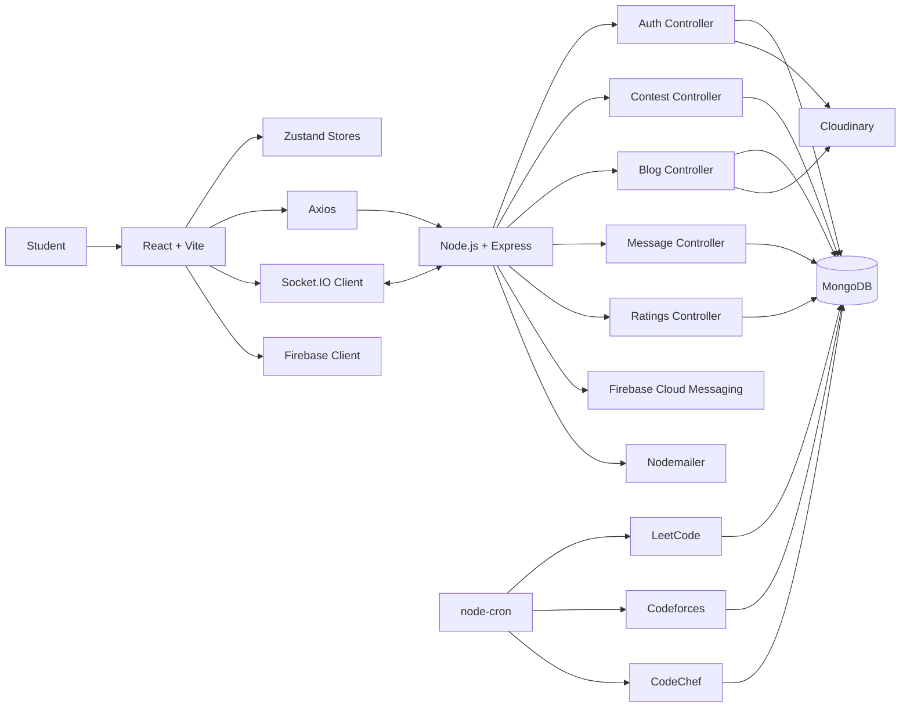
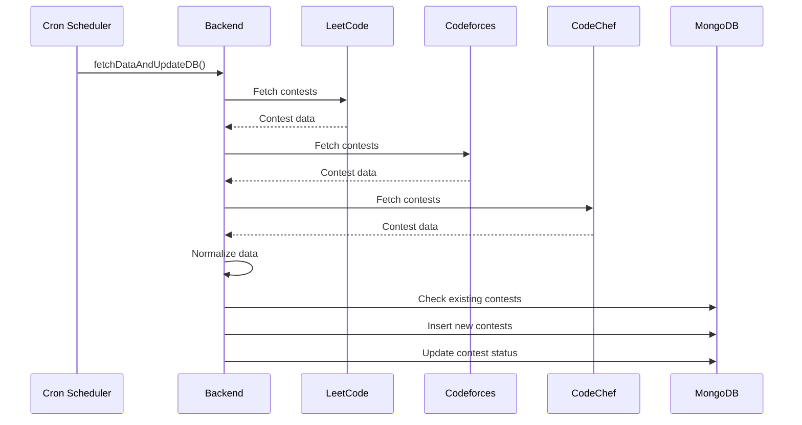
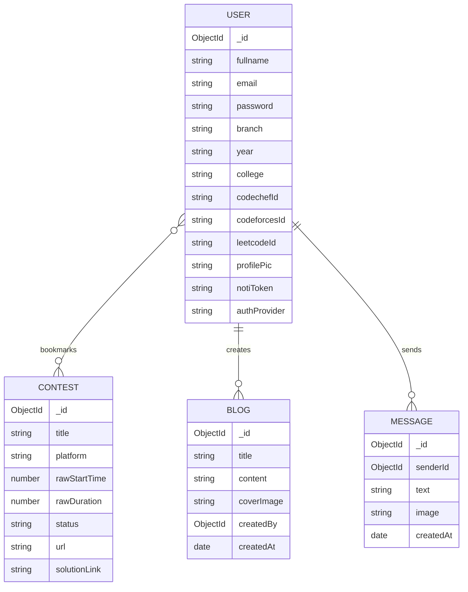
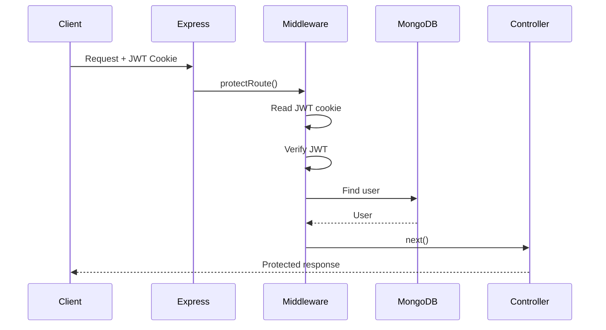

# HACC — Competitive Programming Platform

<p align="center">
  
  
  
  
  
  
</p>

<p align="center">
  <strong>A full-stack competitive programming platform built for students.</strong>
</p>

<p align="center">
  Aggregate coding profiles, discover upcoming contests, track progress, connect with peers, and manage your competitive programming journey from one place.
</p>

---

## 📌 Overview

Competitive programmers typically rely on multiple platforms to track their progress:

* LeetCode for problems and contests
* Codeforces for ratings and contests
* CodeChef for contests and ratings
* Discord/WhatsApp for community communication
* Separate tools for reminders and notifications

**HACC brings these workflows together into a single student-focused platform.**

The application provides:

* 📊 Competitive programming statistics
* 🏆 Upcoming contest aggregation
* 🔖 Contest bookmarking
* 🔔 Contest notifications
* 💬 Real-time community chat
* 📝 Programming blogs
* 👤 Student profiles
* 🔐 Multiple authentication methods
* 🖼️ Cloud-based image uploads
* 📅 Add contests to calendars

The backend periodically retrieves contest information from external competitive-programming platforms, normalizes it, and stores it in MongoDB. The React frontend then consumes a unified API instead of dealing with each external platform independently.

---

# ✨ Features

## 📊 Competitive Programming Dashboard

Students can connect their:

* LeetCode account
* Codeforces account
* CodeChef account

and view aggregated statistics such as:

* Contest rating
* Maximum rating
* Contest participation
* Global ranking
* Problems solved
* Difficulty-wise problem distribution
* Platform-specific information

### Supported platforms

| Platform   | Integration            |
| ---------- | ---------------------- |
| LeetCode   | GraphQL API + scraping |
| Codeforces | REST API               |
| CodeChef   | API + web scraping     |

---

## 🏆 Contest Aggregation

HACC collects upcoming contests from multiple competitive-programming platforms.

Instead of making the frontend communicate directly with three different platforms:

```text
LeetCode ──────┐
Codeforces ────┼──> HACC Backend ──> MongoDB
CodeChef ──────┘
                         │
                         ▼
                    React Frontend
```

Contest information is normalized into a common structure containing fields such as:

* Platform
* Contest title
* Contest URL
* Start time
* Duration
* Status
* Solution link

A scheduled backend job periodically refreshes contest data.

---

## ⏱️ Contest Countdown

Upcoming contests display a live countdown showing:

```text
Days : Hours : Minutes : Seconds
```

The frontend calculates the remaining time using the contest's start timestamp.

---

## 🔖 Contest Bookmarks

Users can bookmark contests they want to participate in.

Bookmarked contests can then be filtered from the main contest dashboard.

---

## 📅 Calendar Integration

Upcoming contests can be added to:

* Google Calendar
* Microsoft Outlook
* Apple Calendar

For Apple Calendar, HACC generates an `.ics` calendar file directly in the browser.

---

## 🔔 Notifications

The project integrates Firebase Cloud Messaging for browser notifications.

Users can grant notification permission and receive contest-related notifications.

```text
Browser
   │
   ▼
Firebase Cloud Messaging
   │
   ▼
Notification Token
   │
   ▼
HACC Backend
   │
   ▼
Contest Notification
```

---

## 💬 Real-Time Community Chat

HACC includes a real-time chat system powered by **Socket.IO**.

Messages are persisted in MongoDB while Socket.IO is used for immediate delivery.

```text
User A
   │
   │ HTTP
   ▼
Express API
   │
   ▼
MongoDB
   │
   │
   └──────────────┐
                  ▼
             Socket.IO
                  │
          ┌───────┴───────┐
          ▼               ▼
       User A           User B
```

The system also tracks online users through Socket.IO connections.

---

## 📝 Developer Blogs

Users can create and read programming-related blogs.

The blog system supports:

* Rich-text editing
* Blog cover images
* Author information
* Cloud image storage

The editor is powered by **TinyMCE**, while images are uploaded to **Cloudinary**.

---

## 👤 Student Profiles

Users can maintain profiles containing information such as:

* Name
* College
* Branch
* Year
* Profile picture
* Competitive programming usernames
* Competitive programming statistics

---

## 🔐 Authentication

HACC supports multiple authentication flows.

### Traditional authentication

```text
Email + Password
        │
        ▼
     bcrypt
        │
        ▼
   MongoDB User
        │
        ▼
      JWT
        │
        ▼
 HTTP-only Cookie
```

### OAuth

Firebase Authentication is used for:

* Google Sign-In
* GitHub Sign-In

### OTP authentication

The application also provides email-based OTP login.

---

# 🏗️ Architecture

## High-Level Architecture



---

# 🔄 Contest Data Pipeline

Contest data is periodically synchronized from external platforms.



This approach provides a **single contest API** to the frontend while reducing repeated requests to external platforms.

---

# 🗂️ Project Structure

```text
HACC/
│
├── backend/
│   │
│   ├── controllers/
│   │   ├── auth.controller.js
│   │   ├── blog.controller.js
│   │   ├── chefapi.controller.js
│   │   ├── contest.controller.js
│   │   ├── contact.controller.js
│   │   ├── forcesapi.controller.js
│   │   ├── leetapi.controller.js
│   │   ├── message.controller.js
│   │   └── ratings.controller.js
│   │
│   ├── middlewares/
│   │   ├── auth.middleware.js
│   │   └── multer.middleware.js
│   │
│   ├── models/
│   │   ├── user.model.js
│   │   ├── contest.model.js
│   │   ├── blog.model.js
│   │   ├── message.model.js
│   │   └── otp.model.js
│   │
│   ├── routes/
│   │   ├── auth.route.js
│   │   ├── blog.route.js
│   │   ├── contest.route.js
│   │   ├── message.route.js
│   │   ├── ratings.route.js
│   │   └── contact.route.js
│   │
│   ├── webscrapping/
│   │   └── scrapRating.js
│   │
│   ├── lib/
│   │   ├── db.js
│   │   ├── socket.js
│   │   ├── cloudinary.js
│   │   ├── firebase-admin.js
│   │   └── utils.js
│   │
│   ├── constants.js/
│   │   ├── ApiError.js
│   │   └── ApiResponse.js
│   │
│   ├── package.json
│   └── index.js
│
├── frontend/
│   │
│   ├── src/
│   │   ├── components/
│   │   ├── stores/
│   │   ├── context Api/
│   │   ├── lib/
│   │   ├── skeleton-screen/
│   │   ├── App.jsx
│   │   └── main.jsx
│   │
│   ├── public/
│   ├── package.json
│   └── vite.config.js
│
└── README.md
```

---

# 🛠️ Tech Stack

## Frontend

| Technology                   | Purpose                           |
| ---------------------------- | --------------------------------- |
| React                        | UI development                    |
| Vite                         | Build tool and development server |
| React Router                 | Client-side routing               |
| Zustand                      | Global state management           |
| Axios                        | REST API communication            |
| Socket.IO Client             | Real-time communication           |
| Tailwind CSS                 | Styling                           |
| Framer Motion                | Animations                        |
| Recharts                     | Data visualization                |
| Three.js / React Three Fiber | 3D UI                             |
| TinyMCE                      | Rich-text blog editor             |
| Firebase                     | Authentication and messaging      |

## Backend

| Technology        | Purpose                  |
| ----------------- | ------------------------ |
| Node.js           | JavaScript runtime       |
| Express           | REST API server          |
| MongoDB           | Database                 |
| Mongoose          | MongoDB ODM              |
| JWT               | Authentication           |
| bcryptjs          | Password hashing         |
| Socket.IO         | Real-time communication  |
| Multer            | File uploads             |
| Cloudinary        | Image storage            |
| Firebase Admin    | Push notifications       |
| Nodemailer        | Email                    |
| node-cron         | Scheduled jobs           |
| Axios             | External API requests    |
| Cheerio           | HTML parsing             |
| Puppeteer         | Browser automation       |
| Puppeteer Stealth | Dynamic website scraping |
| Apollo Client     | GraphQL requests         |

---

# 🧩 Database Design

The main entities are:



---

# 🔑 Authentication Flow

Protected backend routes use JWT authentication.



---

# 📡 API Architecture

The backend follows a REST-style API structure.

Typical organization:

```text
/api
│
├── /auth
│   ├── /signup
│   ├── /login
│   ├── /logout
│   ├── /check
│   └── ...
│
├── /contest
│   ├── /list
│   ├── /bookmark
│   └── ...
│
├── /blog
│   ├── /add
│   ├── /all
│   └── /:id
│
├── /message
│   ├── /send
│   └── /get
│
└── /ratings
```

The frontend communicates with the deployed backend through an Axios instance configured with:

```javascript
withCredentials: true
```

which allows the authentication cookie to be sent with API requests.

---

# ⚙️ Local Development

## 1. Clone the repository

```bash
git clone https://github.com/suyashdwivedi2003/HACC---CP-Platform-for-Student.git

cd HACC---CP-Platform-for-Student
```

---

## 2. Install backend dependencies

```bash
cd backend
npm install
```

---

## 3. Install frontend dependencies

```bash
cd ../frontend
npm install
```

---

# 🔐 Environment Variables

Create a `.env` file inside `backend/`.

Example:

```env
PORT=5000

MONGODB_URI=your_mongodb_connection_string

JWT_SECRET=your_jwt_secret

EMAIL_USER=your_email
EMAIL_PASS=your_email_password
EMAIL_RECEIVER=receiver_email

CLOUDINARY_CLOUD_NAME=your_cloudinary_cloud_name
CLOUDINARY_API_KEY=your_cloudinary_api_key
CLOUDINARY_API_SECRET=your_cloudinary_api_secret
```

The frontend Firebase configuration should be provided through Vite environment variables:

```env
VITE_FIREBASE_API_KEY=...
VITE_FIREBASE_AUTH_DOMAIN=...
VITE_FIREBASE_PROJECT_ID=...
VITE_FIREBASE_STORAGE_BUCKET=...
VITE_FIREBASE_MESSAGING_SENDER_ID=...
VITE_FIREBASE_APP_ID=...
VITE_FIREBASE_MEASUREMENT_ID=...
```

> ⚠️ **Never commit secrets, private keys, service-account credentials, or production API credentials to Git.**

---

# ▶️ Running the Application

## Start backend

```bash
cd backend
npm start
```

or, depending on the configured script:

```bash
npm run dev
```

## Start frontend

```bash
cd frontend
npm run dev
```

Vite will provide the local development URL in the terminal.

---

# 🖥️ Screenshots

> Add screenshots to `frontend/public/screenshots/` or `assets/` and update these paths.

## Dashboard


## Contest Dashboard


## Student Profile


## Real-Time Chat


## Blog Platform


---

# 🧠 Engineering Highlights

The project was built around several practical engineering problems rather than being only a CRUD application.

### 1. External API Aggregation

Different competitive-programming platforms expose different APIs and data formats.

HACC normalizes these responses into a common contest representation before storing them.

---

### 2. Scheduled Data Synchronization

Contest information is refreshed periodically using `node-cron`.

This avoids making every user request dependent on multiple third-party services.

---

### 3. Real-Time Communication

Socket.IO provides event-driven communication for the community chat and online-user tracking.

---

### 4. Authentication

The application combines:

* JWT-based authentication
* HTTP-only cookies
* bcrypt password hashing
* Firebase authentication

---

### 5. Media Handling

Uploaded images are temporarily handled by Multer and then transferred to Cloudinary rather than being permanently stored on the application server.

---

### 6. Frontend State Management

Zustand stores separate application domains:

```text
useAuthStore
useContestStore
useBlogStore
useChatStore
```

This keeps authentication, contest, blog and chat state independent.

---

# 📈 Design Considerations

HACC currently uses a scheduled synchronization model:

```text
External Platforms
       │
       ▼
Scheduled Fetch
       │
       ▼
Normalization
       │
       ▼
MongoDB
       │
       ▼
REST API
       │
       ▼
React
```

This provides:

* lower frontend latency
* reduced dependence on third-party services
* one unified API
* easier frontend development

For a larger deployment, the synchronization layer could be moved into independent background workers with a message queue and retry mechanism.

---

# 🔒 Security Considerations

The application uses several security mechanisms:

* Password hashing using bcrypt
* JWT authentication
* HTTP-only authentication cookies
* Firebase authentication
* Environment-based configuration
* Protected API routes

For a production deployment, additional hardening should include:

* centralized authorization checks
* rate limiting
* stronger input validation
* CSRF protection where applicable
* structured logging
* secret management
* automated security scanning
* API request limits
* stronger OTP expiration and attempt controls

---

# 🧪 Testing Strategy

A production version of HACC should use a layered testing strategy.

```text
                 ┌───────────────┐
                 │   E2E Tests   │
                 │   Playwright  │
                 └───────┬───────┘
                         │
                 ┌───────▼───────┐
                 │ Integration   │
                 │ Supertest /   │
                 │ Socket.IO     │
                 └───────┬───────┘
                         │
                 ┌───────▼───────┐
                 │ Unit Tests    │
                 │ Vitest/Jest   │
                 └───────────────┘
```

Important scenarios include:

* authentication
* authorization
* contest synchronization
* duplicate contest handling
* bookmarking
* profile updates
* external API failures
* chat message persistence
* Socket.IO reconnection
* image upload failures
* OTP expiry
* invalid input

---

# 🚀 Future Improvements

Potential improvements include:

* [ ] Automated unit and integration test suite
* [ ] Playwright end-to-end testing
* [ ] Redis caching
* [ ] Background job queue for external API synchronization
* [ ] Provider-specific retry mechanisms
* [ ] Rate limiting
* [ ] Centralized error handling
* [ ] Structured logging and monitoring
* [ ] API documentation with OpenAPI/Swagger
* [ ] Database indexing and query optimization
* [ ] Pagination for chat/blog/contest APIs
* [ ] Stronger OTP expiration and rate limiting
* [ ] CI/CD pipeline
* [ ] Dockerized deployment
* [ ] Role-based administration
* [ ] Contest participation analytics

---

# 📚 Key Engineering Concepts Demonstrated

This project provided practical exposure to:

* Full-stack web development
* REST API design
* MongoDB data modeling
* Mongoose
* JWT authentication
* OAuth/Firebase authentication
* Password hashing
* WebSockets / Socket.IO
* Third-party API integration
* GraphQL API consumption
* Web scraping
* Scheduled background jobs
* File upload pipelines
* Cloud storage
* Push notifications
* Client-side state management
* Asynchronous JavaScript
* API error handling
* Data normalization

---

# 🎯 Why HACC?

HACC was designed around a simple idea:

> **Competitive programmers shouldn't need five different tools to manage their coding journey.**

By combining contest discovery, competitive-programming statistics, student profiles and community features, HACC creates a single platform tailored to the needs of student programmers.

---

# 👨‍💻 Author

**Suyash Dwivedi**

Electrical Engineering
NIT Raipur

GitHub:
https://github.com/suyashdwivedi2003

---

# ⭐ Project

If you find HACC useful or interesting, consider giving the repository a ⭐.

```text
Competitive Programming
        +
Community
        +
Analytics
        +
Real-Time Communication
        +
Automation
        =
                     HACC
```
